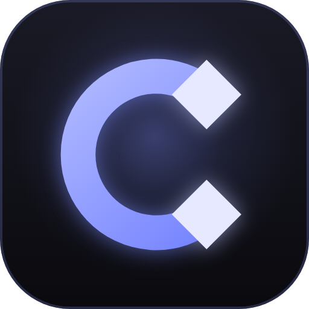

<p align="center"></p>

# Cadence Animator

A standalone Roblox animation app — animate rigs in a real desktop app (not a Studio plugin UI), then sync with Roblox Studio to bring rigs in and send finished animations back out.

## Running it

```
npm install
npm start
```

To build a Windows installer/portable exe:

```
npm run dist
```

Output lands in `dist/`.

## Connecting Roblox Studio

Cadence talks to Studio over a local HTTP bridge (`127.0.0.1:35747`) via a small companion plugin.

1. In the app, click the **Studio offline** chip (top right) → installs `CadenceBridge.lua` into your Roblox Plugins folder.
2. Restart Studio.
3. In **Game Settings → Security**, turn on **Allow HTTP Requests**.
4. Click **Connect** on the new "Cadence Animator" toolbar tab in Studio.

Once connected, the chip turns green and shows the place name.

### What the plugin gives you

- **Add rig → Your Roblox avatar…** — builds the real avatar for any username, live in Studio, and pulls it in.
- **Add rig → From Studio selection** — select any rig's Model in Explorer, Cadence fetches it (any nesting depth, any part count).
- **Add from asset ID** — inserts any Roblox model asset via Studio's own InsertService.
- **Import → By Roblox animation ID** — pulls a published animation's keyframes straight in.
- **Import → From a rig in Studio** — reads `AnimSaves` folders (the same convention Roblox's own Animation Editor and Moon Animator both use), so existing Moon exports on a rig are importable too.
- **Export → Straight into Studio** — writes a `KeyframeSequence` into `<rig>.AnimSaves.<name>`, ready for Studio's Animation Editor to Import.
- **Export → Publish to Roblox** — same as above, plus a reminder of the one remaining manual step: third-party plugins can't push directly to Roblox's asset servers (nothing can, by design), so you open the Animation Editor → Import → Export to get the asset ID. That's a Roblox platform limitation, not an app limitation.
- Two toolbar buttons in Studio itself: **Send Selection** (push a rig to Cadence without Cadence asking first) and **Sync Pose** (re-read a rig's current geometry after using Studio's native Move/Rotate tools on it, in case you edited the reference rig outside Cadence).

One honest limitation: you can't literally drag an item out of Studio's Explorer panel into Cadence's window — Studio doesn't support that as an OS-level drag source. "Add from Studio selection" is the equivalent: select it in Explorer, one click in Cadence.

## Everything autosaves

There's no "save before you close or you lose your work" — every change writes to disk within a second, and the last 10 generations are kept as rolling backups. On launch, Cadence offers to restore your last session if it had anything in it.

## Rig types

R6, R15, Rthro, Rthro Slender ship built in. Anything else — your own avatar, a specific asset ID, a `.rbxm`/`.rbxmx` file — comes in through the flows above, at any hierarchy depth, with UGC textures (including `SurfaceAppearance` face textures) applied automatically.

## The semantic layer

`renderer/js/ai/**` lets an AI reason about a shot in animation terms instead of raw CFrames. It
projects the project into stable-id graphs — a Scene Graph, a Rig Graph, a Timeline Graph and a
Dependency Graph — where every part and joint carries a semantic role (hips, chest, wrist, the
planted foot) together with the evidence and certainty behind that mapping. So `resolve_semantic`
can answer "the left foot" as a naming fact, "the planted foot" as a measurement, and "the weapon
hand" with a question when nothing is actually held, rather than guessing.

It also adds content-addressed immutable snapshots, a keyframe-level project diff that reports the
exact frame range an edit touched, a rig validation pass, and a provenance graph that lives inside
the project — so "which request caused this keyframe?" is still answerable after a save and reload.

Twelve MCP tools expose it: `inspect_scene`, `inspect_rig`, `inspect_timeline`,
`resolve_semantic`, `selection_vocabulary`, `set_semantic_role`, `snapshot_scene`,
`list_snapshots`, `restore_snapshot`, `diff_snapshots`, `record_provenance`,
`inspect_provenance`. Each states up front whether it is read-only, mutating or destructive.

The layer is deliberately honest about its own limits: every result reports what it actually
examined, and `inspect_scene` returns a list of what the layer can and *cannot* do. Later phases
added transactions with scoped rollback, constraints and locks, a formal animation language and
planner, silhouette and object-ID passes with baselines, motion and contact measurement, a VFX
compiler timed to shot events, operating modes, experiments, a structured shot review, knowledge,
memory and style, and — last — a benchmark library that runs the real pipeline on permanent
fixtures and an improvement loop that evaluates a proposed change against it without ever applying
one. Design, status per requirement, and the defects this work uncovered are in
[`docs/animation-intelligence/`](docs/animation-intelligence/).

## Keyboard

`Ctrl+K` opens the command palette — type what you want to do. `?` shows the full shortcut sheet, or click **⌘ Shortcuts** in the title bar. The essentials: `Space` play/pause, `W`/`E` move/rotate, `S` key the current pose, `A` toggle auto-key, `C` rotation-grid snap, `F` focus selected.

## Auto-update

Cadence checks GitHub Releases for a newer version shortly after launch, and via **Check for updates** in the command palette any time. If one's found, a chip appears in the title bar — click it to download, then click again (or "Restart now" in the confirm dialog) to install. Nothing downloads or installs without you clicking; a background check never interrupts you.

This only works in the **installed** build (the NSIS installer, not the portable exe — a portable app has nothing for the updater to replace in place). Published to [alycoulibal2-sketch/Cadence-Animator](https://github.com/alycoulibal2-sketch/Cadence-Animator).

### Cutting a new release

You'll need a GitHub Personal Access Token with `repo` scope (Settings → Developer settings → Personal access tokens) to publish. Set it as an env var, never commit it or put it in a URL that lands in `.git/config`.

Every release:
1. Bump `version` in `package.json` (and re-sync `package-lock.json`'s version with `npm install --package-lock-only`) — electron-updater compares this against what's installed, so it must go up.
2. Run the tests. The three plain-Node suites are the fast loop and need no Electron:

   ```bash
   node test/coretest.mjs              # the pure effect core
   node test/pnxtest.mjs               # the PNX procedural engine
   node test/aitest.mjs                # the semantic layer (renderer/js/ai/**)
   node tools/benchmark.mjs --compare  # the animation-intelligence benchmarks vs their committed baseline
   ```

   The last one exits non-zero when a measured outcome moved in either direction. If the change
   was meant to move it, `node tools/benchmark.mjs --write-baseline` and commit the new
   `renderer/js/ai/benchmarkBaseline.js` with it.

   Then `npm run smoketest` — the in-app pass (one check, classic clothing, needs the Roblox CDN).
   Wipe `test-output/userdata` and kill stray `electron` processes first. Some `pnxtest` and
   smoketest checks assert wall-clock budgets and fail on slower hardware without anything being
   broken — check whether a failure is a timing assertion before treating it as a regression.
3. `GH_TOKEN=<your token> npm run release` — builds the installer/portable exe and publishes a GitHub Release with them attached, tagged from `package.json`'s version.
4. **Update the website.** This is part of the release, not a follow-up — the site prints the version, both file sizes, both SHA-256 checksums and a lot of exact counts, and every one of those goes stale on its own:

   ```bash
   node site/tools/gen-shortcuts.js   # regenerate the keyboard reference from app.js
   node site/tools/sync-release.js    # refresh version, filenames, sizes, checksums
   ```

   Then write any new capability into `site/index.html`'s feature grid and the matching `site/docs.html` section by hand — no script can do that part. Re-count anything countable from source rather than copying a number out of a changelog. Full checklist and the counting one-liners are in [`site/README.md`](site/README.md).
5. Publish the site: push `main`, then `git subtree split --prefix=site -b gh-pages-tmp && git push origin gh-pages-tmp:gh-pages --force && git branch -D gh-pages-tmp`. Live at <https://alycoulibal2-sketch.github.io/Cadence-Animator/>.
6. Done. Anyone on an older version sees the update chip next time they open the app (or within its periodic check).

`npm run dist` (no token, no publish) still works exactly as before for local builds you just want to hand someone directly.

## Website

`site/` holds the project's website — a dependency-free static site, deployed to GitHub Pages. It doubles as the public documentation. See [`site/README.md`](site/README.md) for how to work on it and for the release checklist above in more detail.

## Logo and icons

The logo lives in `brand/`: `cadence-mark.svg` (the monochrome mark used inline in the app and the site), `cadence-favicon.svg` (the 16 px-tuned tile for browser tabs) and `cadence-icon.svg` (the app icon tile). Every icon the project ships is generated from those three files and never hand-edited:

```
npm run brand
```

That rewrites the Windows `brand/icon.ico`, the installer sidebar, the site favicon and touch icon, and the mobile PWA icons. See `brand/README.md` for what goes where.
